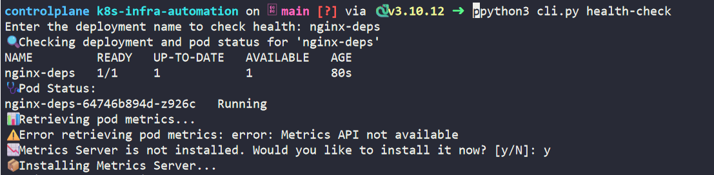

# k8s-infra-automation

A Python-based CLI tool designed to automate Kubernetes infrastructure tasks such as deploying applications, performing health checks, and managing manifests.

---

## Features

This CLI tool provides automated Kubernetes infrastructure operations, including:

- Cluster Connection Setup  
  Easily connect to a Kubernetes cluster using your kubeconfig file.

- Helm and KEDA Installation  
  Automatically checks and installs Helm (if missing), and deploys KEDA for event-driven autoscaling.

- Deployment Automation  
  Create deployments from YAML manifests, with support for:
  - Image, CPU/RAM resources
  - Port exposure
  - Auto-generating Kubernetes Services

- Health Checks  
  - Check the health of deployments and pods.
  - Retrieve pod statuses and container restart counts.
  - Optionally install Metrics Server if not available.

- Resource Metrics (Optional)  
  - If Metrics Server is available, retrieve live CPU and memory usage per pod.

- Manifest-Driven Customization  
  Supports external YAML manifests (`manifest/` folder) for deployments and scaling.

- Modular Structure  
  Organized codebase with modular commands and utilities using Python's `click`.

---

## Prerequisites

- Python 3.6 or higher
- `kubectl` configured for your cluster
- Click library for CLI interactions

---

## Project Structure

```
k8s-infra-automation/
├── cli.py
├── commands/
│   ├── deploy.py
│   └── health.py
├── manifest/
│   ├── deployment.yaml
│   ├── service.yaml
│   └── scaledobject.yaml
├── utils/
│   └── manifest_generator.py
├── requirements.txt
└── README.md
```

- `cli.py`: Main entry point for the CLI tool.
- `commands/`: Contains command modules for deployment and health checks.
- `manifest/`: Holds YAML files for Kubernetes resources.
- `utils/`: Includes helper functions for manifest generation.

---

## Getting Started

### Installation

1. Clone the repository:

   ```bash
   git clone https://github.com/Gautamram123/k8s-infra-automation.git
   cd k8s-infra-automation
   ```

2. Install dependencies

   ```bash
   pip install -r requirements.txt
   ```

---

## Usage

### Connect to the Kubernetes Cluster:

```bash
python3 cli.py setup-k8s-connection
```


### Install KEDA:

```bash
python3 cli.py install-keda
```


### Create Deployment:

```bash
python3 cli.py create-deployment
```


### Health Check

```bash
python3 cli.py health-check
```


---

## Manifest Files

The `manifest/` directory contains YAML files for:

- `deployment.yaml`: Defines the deployment configuration.
- `service.yaml`: Exposes the deployment as a service.
- `scaledobject.yaml`: (Optional) Configures KEDA for autoscaling.

---

## Contributing

Contributions are welcome! Please fork the repository and submit a pull request.
